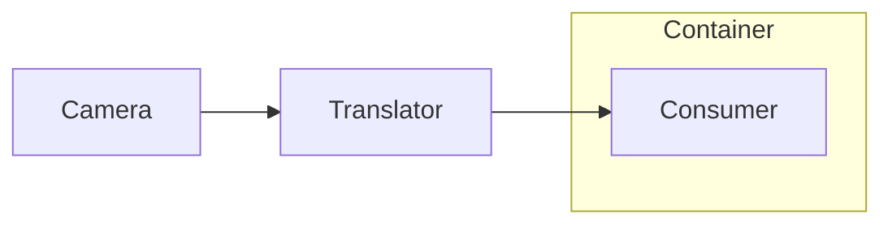

# Obsidian-flavored Markdown

What separates a note that feels native from one that reads like a pasted README.

## Callouts

```markdown
> [!tip] Title
> Body text.

> [!warning]+ Expanded by default
> The `+` suffix renders open.

> [!question]- Collapsed by default
> The `-` suffix renders folded — the reader clicks to reveal.
```

Common types: `note` `abstract` `info` `tip` `success` `question` `warning` `caution` `failure`
`danger` `bug` `example` `quote` `important`.

**The `-` (collapsed) variant is the highest-value formatting device in a long note.** Use it for:

- **Self-test Q&A** — question visible, answer folded. Turns a document a reader skims into one they
  actually learn from.
- **Reference tables** (port lists, glossaries, cheat sheets) that would otherwise bury the
  actionable content.
- **Context help next to a control** — a button with a folded "how to read this output" beneath it.

Callouts nest and contain full Markdown, including tables and code blocks. Indent continuation lines
with `> `.

## Links

| Form | Use |
|---|---|
| `[[Note name]]` | Link to a note (no path needed if the name is unique in the vault) |
| `[[Note name#Heading]]` | Link to a heading inside another note |
| `[[#Heading]]` | Link within the current note — use for a table of contents |
| `[[Note\|display text]]` | Custom link text |
| `![[Note]]` / `![[image.png]]` | **Embed** the target inline rather than link to it |
| `[text](file:///C:/path/to/file)` | Open a file or folder outside the vault |

Traps:

- **Wikilinks are name-based, not path-based.** Renaming or moving a note breaks hand-written links
  unless the name stays the same. After moving a note, grep the vault for its old name.
- **Heading anchors must match the heading text exactly**, including punctuation and emoji. Copy the
  heading rather than retyping it.
- **`file:///` URLs need percent-encoding for non-ASCII and spaces.** A path with CJK characters
  will not resolve as-is: `方案.md` → `%E6%96%B9%E6%A1%88.md`. Encode, or the link silently does
  nothing.
- A `[[wikilink]]` to a note that does not exist yet is legal — it renders as an "unresolved" link
  and creates the note when clicked. Useful for planned notes; verify you did not simply typo.

## Mermaid

Fenced ` ```mermaid ` blocks render natively — no plugin required.

````markdown

````

Keep diagrams simple. Quote node labels containing punctuation, parentheses or CJK: `A["文字 (说明)"]`.
Emoji inside labels generally render but add failure risk in exchange for little value. Use `<br/>`
for line breaks inside a label.

## Frontmatter

```yaml
---
tags: [project-name, topic]
project: Project Name
created: 2026-08-08
status: draft
---
```

Fields become queryable properties. Match whatever convention the vault already uses; if the vault
has none, keep it minimal — `tags` plus one or two facts that would be useful to filter on later.

## Structural conventions worth following

- **One H1** matching the note's purpose; the filename is the identity, the H1 is the title.
- **Table of contents** via `[[#Heading]]` links for anything over ~200 lines. Obsidian has an
  outline pane, but an in-note TOC works in preview, on mobile, and when exported.
- **Horizontal rules (`---`) between major sections** give long notes a scannable rhythm.
- **Companion notes link both ways.** When adding a note that belongs with an existing one, edit the
  existing note too. One-directional links rot.
- **Tables**: Obsidian (and some linters) reformat table column widths on save. Do not be surprised
  when a table you wrote comes back re-padded — it is cosmetic.

## Creating and editing note files

### Where the file goes

Follow the vault's existing shape rather than imposing one. Look before writing:

```powershell
Get-ChildItem "<vault>" -Recurse -Filter "*.md" | Select-Object -First 20 FullName
```

If notes are grouped in per-project folders, put yours in the matching folder and use the short
local name (`控制台.md` inside `Carema-Kis-AI/`) rather than a globally-qualified one
(`Carema-Kis-AI 控制台.md` at the root). Users reorganize toward this shape on their own; matching
it up front avoids a later move that breaks links.

### Filenames

- Spaces, CJK, `·`, `—` are all fine and common in vaults.
- **Avoid `# ^ [ ] |`** — they are meaningful in wikilinks and heading anchors, and a filename
  containing them cannot be linked cleanly.
- `/` and `\` are path separators, and Windows additionally forbids `: * ? " < >`.
- The filename *is* the note's identity for `[[wikilinks]]`. Renaming breaks every hand-written link
  to it; if you rename, grep the vault for the old name and fix the referrers.

### Encoding

Plain UTF-8, **no BOM**. (The BOM requirement in `windows-scripts.md` applies to `.ps1` files
executed by `powershell.exe`, not to notes.)

### Editing while Obsidian is running

Unlike `.obsidian/**/data.json` — which must never be touched while the app runs — **note files are
safe to edit externally**. Obsidian watches the vault and reloads changed files.

Still:

- **Prefer targeted edits over wholesale rewrites** of a note the user may have open. A rewrite
  discards anything they changed since you last read it.
- **Re-read before editing** if time has passed. Notes get moved, renamed, and hand-edited between
  turns; an edit that fails with "file does not exist" usually means the note moved, not that it is
  gone. Search by name before recreating it — recreating produces a duplicate and orphans the links.
- **Expect cosmetic reformatting.** Obsidian and Markdown linters re-pad table columns and normalize
  spacing on save. A table coming back with different column widths is not a conflict; do not
  "fix" it.
- Preserve the user's own content. If they added lines to something you wrote, work around their
  additions rather than reverting to your version.

### Companion notes

When adding a note that belongs with an existing one, **edit the existing note too** to link back.
One-directional links rot — the new note is discoverable only if something points at it.
